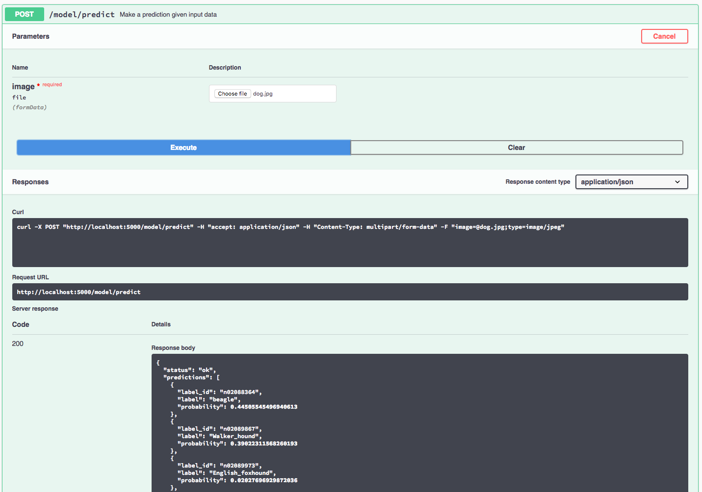

# IBM Code Model Asset Exchange: Inception-ResNet-v2 on ImageNet

This repository contains code to instantiate and deploy an image classification model. This model recognizes the 1000 different classes of objects in the [ImageNet 2012 Large Scale Visual Recognition Challenge](http://www.image-net.org/challenges/LSVRC/2012/). The model consists of a deep convolutional net using the Inception-ResNet-v2 architecture that was trained on the ImageNet-2012 data set. The input to the model is a 299x299 image, and the output is a list of estimated class probilities.

The model is based on the [Keras built-in model for Inception-ResNet-v2](https://keras.io/applications/#inceptionresnetv2). The model files are hosted on [IBM Cloud Object Storage](http://max-assets.s3-api.us-geo.objectstorage.softlayer.net/keras/inception_resnet_v2.h5). The code in this repository deploys the model as a web service in a Docker container. This repository was developed as part of the [IBM Code Model Asset Exchange](https://developer.ibm.com/code/exchanges/models/).

## Model Metadata
| Domain | Application | Industry  | Framework | Training Data | Input Data Format |
| ------------- | --------  | -------- | --------- | --------- | -------------- | 
| Vision | Image Classification | General | Keras | [ImageNet](http://www.image-net.org/) | Image (RGB/HWC)| 

## References

* _C. Szegedy, S. Ioffe, V. Vanhoucke, A. Alemi_, ["Inception-v4, Inception-ResNet and the Impact of Residual Connections on Learning"](https://arxiv.org/abs/1602.07261), CoRR (abs/1602.07261), 2016.
* [Keras Applications](https://keras.io/applications/#inceptionresnetv2)

## Licenses

| Component | License | Link  |
| ------------- | --------  | -------- |
| This repository | [Apache 2.0](https://www.apache.org/licenses/LICENSE-2.0) | [LICENSE](LICENSE) |
| Model Weights | [Apache 2.0](https://www.apache.org/licenses/LICENSE-2.0) | [Keras Inception-ResNet-v2](https://keras.io/applications/#inceptionresnetv2)|
| Model Code (3rd party) | [MIT](https://opensource.org/licenses/MIT) | [Keras LICENSE](https://github.com/keras-team/keras/blob/master/LICENSE)|
| Test assets | Various | [Asset README](assets/README.md) |

## Pre-requisites:

* `docker`: The [Docker](https://www.docker.com/) command-line interface. Follow the [installation instructions](https://docs.docker.com/install/) for your system.
* The minimum recommended resources for this model is 2GB Memory and 2 CPUs.

## Steps

1. [Build the Model](#1-build-the-model)
2. [Deploy the Model](#2-deploy-the-model)
3. [Use the Model](#3-use-the-model)
4. [Development](#4-development)
5. [Clean Up](#5-clean-up)

## 1. Build the Model

Clone this repository locally. In a terminal, run the following command:

```
$ git clone https://github.com/IBM/MAX-Inception-ResNet-v2.git
```

Change directory into the repository base folder:

```
$ cd MAX-Inception-ResNet-v2
```

To build the docker image locally, run: 

```
$ docker build -t max-keras-inceptionresnetv2 .
```

All required model assets will be downloaded during the build process. _Note_ that currently this docker image is CPU only (we will add support for GPU images later).


## 2. Deploy the Model

To run the docker image, which automatically starts the model serving API, run:

```
$ docker run -it -p 5000:5000 max-keras-inceptionresnetv2
```

## 3. Use the Model

The API server automatically generates an interactive Swagger documentation page. Go to `http://localhost:5000` to load it. From there you can explore the API and also create test requests.

Use the `model/predict` endpoint to load a test image (you can use one of the test images from the `assets` folder) and get predicted labels for the image from the API.



You can also test it on the command line, for example:

```
$ curl -F "image=@assets/dog.jpg" -XPOST http://127.0.0.1:5000/model/predict
```

You should see a JSON response like that below:

```json
{
  "status": "ok",
  "predictions": [
    {
      "label_id": "n02088364",
      "label": "beagle",
      "probability": 0.44505545496941
    },
    {
      "label_id": "n02089867",
      "label": "Walker_hound",
      "probability": 0.3902231156826
    },
    {
      "label_id": "n02089973",
      "label": "English_foxhound",
      "probability": 0.02027696929872
    },
    {
      "label_id": "n02088632",
      "label": "bluetick",
      "probability": 0.010103852488101
    },
    {
      "label_id": "n02088238",
      "label": "basset",
      "probability": 0.001649746671319
    }
  ]
}
```

## 4. Development

To run the Flask API app in debug mode, edit `config.py` to set `DEBUG = True` under the application settings. You will then need to rebuild the docker image (see [step 1](#1-build-the-model)).
